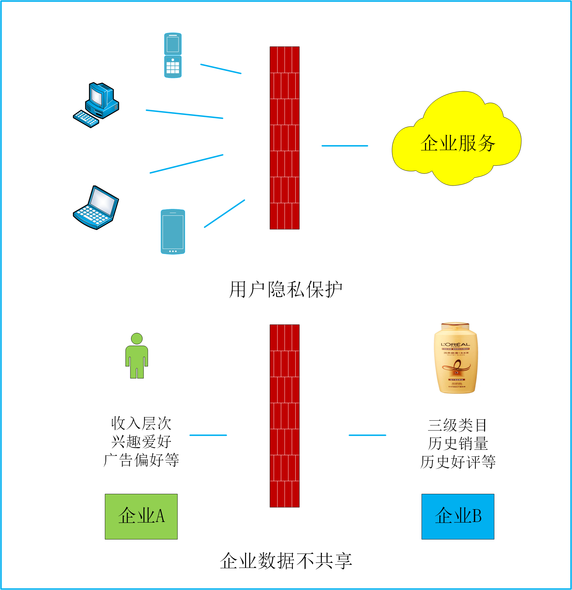
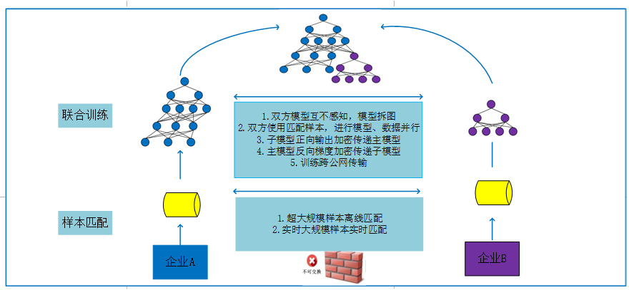

# 九数联邦学习整体解决方案

## 概述

数据是人工智能的基石，打破数据孤岛，实现数据共享是加速人工智能高速发展的必要条件。联邦学习，作为数据安全计算的业界前沿技术方案，在保护数据隐私的同时深度连接各个合作方，达到技术赋能、共创共赢的目标。

## 1 整体架构

- 整个系统分为四个大模块
  - 整体调度与转发模块
  - 资源管理与调度模块
  - 数据求交模块
  - 训练器模块

## 2 整体调度与转发模块

- 整体控制数据求交与训练的调度
- 训练器的配对工作
- 高效的流量转发

## 3 资源调度与管理模块

- 使用k8s屏蔽底层资源差异
- 使用k8s进行资源的动态调度

## 4 数据求交

- 异步分布式框架提升拼接效率

## LICNESE

9nFL使用apache2.0许可

