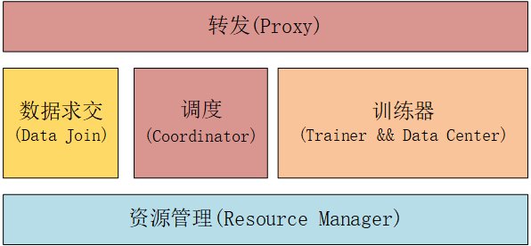
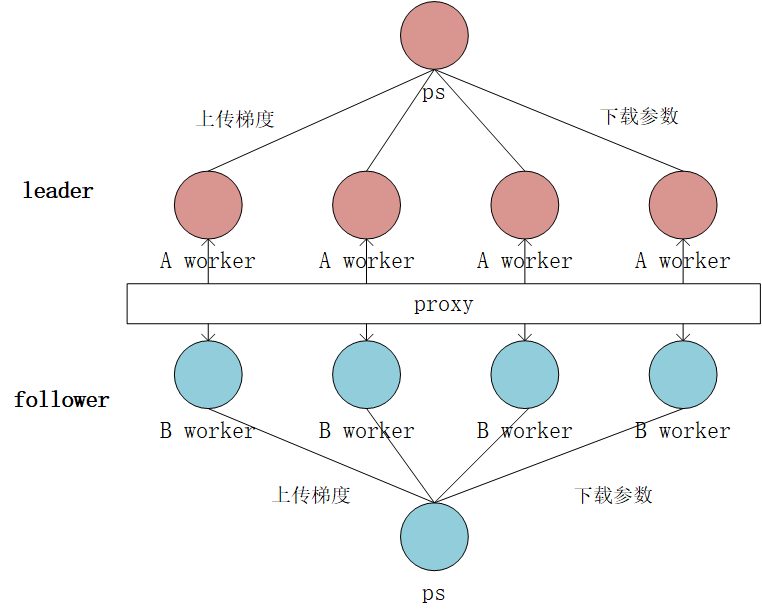

9n联邦学习系统概述
------------

## 1. 系统设计

9n联邦学习为解决纵向联邦学习问题设计，即一条训练数据的特征由两方持有，双方合作在两个集群上同时训练一个模型。

发起训练的一方称为`leader`，另一方称为`follower`（注意：与谁有label无关），目前只支持tensorflow。

由于一条训练数据的特征由两方持有，训练时保证batch级别的样本对齐直接影响的模型训练的“正确性”。

为了训练系统的简单，我们引入`data join`数据求交模块，作为联合训练的前置任务。

业务方约定好标识同一条样本的`example_id`，并约定好`hash 函数`和`partition num`分区数，

每条样本被划分到某个分区。每个分区并行执行，求交后，两方各自持有一系列严格对齐的`datablock`。

训练时leader发送`block_id`, follower就知道取哪个`datablock`。

为了支持大规模训练，我们引入了数据并行(分布式训练)和模型并行(拆图)。

普通的tensorflow分布式训练，一次训练任务由若干ps和worker(master或普通worker)构成；

在联邦学习系统设计时，为了简单，我们将传统的tensorflow任务做对称镜像，双方使用相同数量的worker并配对：

传统意义上的1个worker在拆图的分界面分裂成了两个worker，它们的通信需要跨集群甚至跨公网, 而ps则为双方私有。

考虑到双方训练数据需要严格对齐，双方的训练任务里均引入`data center`模块来分配数据。

`coordinator`模块负责任务提交、配置校验，

如果校验通过，则调用`resouce manager`模块在k8s上拉起工作集群，

随后`coordinator`会对双方的工作节点进行配对，并监控训练任务。

考虑到安全性，我们不允许双方的工作节点之间通信，而是强制通过`proxy`模块进行转发。

求交任务和训练任务不是常驻服务，但`coordinator`和`proxy`建议配置成常驻服务。

