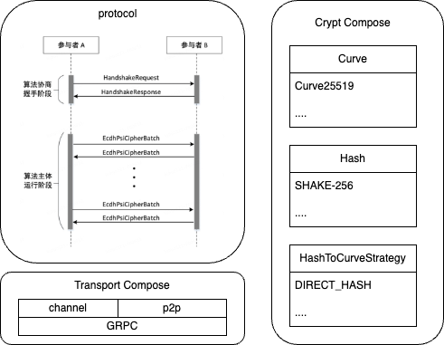

# Interoperable PSI Operator

Implementation of the Interoperable PSI standard according to the [ECDH-PSI specification](https://www.secretflow.org.cn/static/ECDH-PSI.579428f2.pdf).



## Crypto Library

The encryption algorithm library.

### Build Instructions

```bash
maturin build --release && \
pip3 install --force-reinstall target/wheels/crypto-0.1.0-cp310-cp310-manylinux_2_34_x86_64.whl
```

## Link_py

Implementation of the interoperable transport layer protocol, using the implementation from [secretflow/yacl](https://github.com/secretflow/yacl), with Python interface wrapping.

### Build Instructions

```bash
bazel build wheel --compilation_mode=opt --host_compilation_mode=opt && \
pip3 install --force-reinstall bazel-bin/link_py-v0.1-py3-none-any.whl
```

## PSI

The main body of the interoperable PSI algorithm flow.

### Build Instructions

```bash
python3 setup.py bdist_wheel && \
pip3 install --force-reinstall dist/interconnection_psi-0.0.0-py3-none-any.whl
```

## PSI Actors

Main PSI program.

### Build Image

To build the operator into an image:

```bash
docker build -t interconnection_psi_v1 .
```