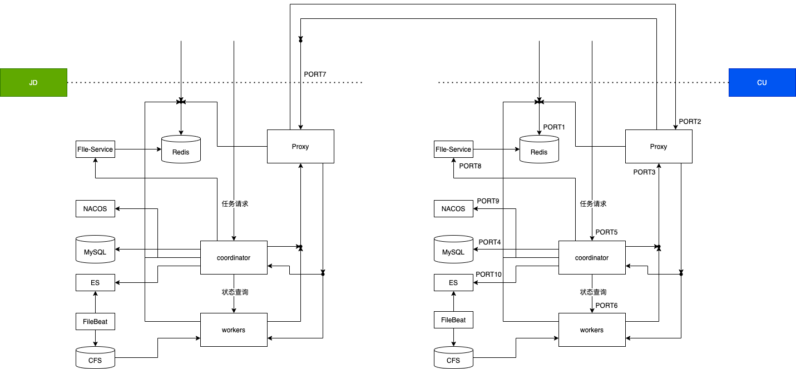

# 隐私计算PSI标品部署操作文档
## 概述
本文档是京东隐私计算PSI产品部署操作文档，用于非京东侧（客户侧）协作方工程师部署操作引导。
## 1 环境要求
- K8S集群

    - 机器操作系统centos7.6-7.9
    - 机器最低规格8c16g

- NFS云存储/PVC
- 公网域名

## 2 基础组件



<table>
  <tr>
    <th>组件</th>
    <th>硬件需求</th>
    <th>镜像</th>
    <th>提供方</th>
    <th>基础镜像</th>
  </tr>
  <tr>
    <td>redis</td>
    <td>0.5c1g</td>
    <td>tianwen3/redis:v3.0</td>
    <td>dockerhub</td>
    <td>redis:latest  redis版本7.0.5</td>
  </tr>
  <tr>
    <td>mysql</td>
    <td>0.5c1g</td>
    <td>mysql_debian_8.0.31</td>
    <td>dockerhub</td>
    <td>-</td>
  </tr>
  <tr>
    <td>proxy</td>
    <td>1c2g</td>
    <td>tianwen3/proxy:v4.1</td>
    <td>dockerhub</td>
    <td>ubuntu:22.04</td>
  </tr>
 <tr>
    <td>nacos</td>
    <td>2c4g</td>
    <td>nacos/nacos-server:v2.2.3</td>
    <td>dockerhub</td>
    <td>-</td>
  </tr>
  <tr>
    <td>fileservice</td>
    <td>1c4g</td>
    <td>fileservice0.7-opensource</td>
    <td>自主生成</td>
    <td>-</td>
  </tr>
  <tr>
    <td>coordinator</td>
    <td>4c8g</td>
    <td>coordinator-opensource</td>
    <td>自主生成</td>
    <td>-</td>
  </tr>
  <tr>
    <td>psi</td>
    <td>4c16g</td>
    <td>psi-opensource</td>
    <td>自主生成</td>
    <td>-</td>
  </tr>
</table>

以上组件需要按顺序部署，其中proxy，psi，redis是用于执行隐私求交所需的必须镜像，nacos、mysql、coordinator是用于接入京东平台所需。

## 3 预定操作
- 创建K8S namespace，建议格式NAMESPACE=“mpc-$COMPANY-cu”，后续部署均在该namespace下进行；
- 设定通信proxy_target，建议与K8S namespace相同，即PROXY_TARGET="mpc-$COMPANY-cu"，该配置项信息将用于后续Proxy部署时证书生成以及跨域通信使用。

## 4 redis

1. 创建[Redis所需configmap配置文件](docs/yamls/redis_configmap.yaml "Redis Configmap")，替换其中如下的相关配置：
- REDIS_POD_PORT=6379
- REDIS_PASSWORD=myRedis-password
- REDIS_CONF=redis
```
kubectl -n ${NAMESPACE} apply -f redis_configmap.yaml
```

2. 创建[RedisPod启动需要的deployment配置文件](docs/yamls/redis_deployment.yaml "Redis Deployment")，替换其中如下的相关配置：
- REDIS_IMAGE=myRedis_image_full_tags
- REDIS_POD_PORT=6379
- REDIS_VOLUME_PATH=myRedis_persist_mount_path
- REDIS_CONF=redis
```
kubectl -n ${NAMESPACE} apply -f redis_deployment.yaml
```

3. 创建[RedisService的启动配置文件](docs/yamls/redis_service.yaml "Redis Service")，替换如下配置：
- REDIS_POD_PORT=6379
- REDIS_SERVICE_PORT=myRedis_service_port
```
kubectl -n ${NAMESPACE} apply -f redis_service.yaml
```
4. 记录开启的redis服务IP，IP来源于截图的第三列：
- REDIS_SERVICE_IP=myRedis_service_ip
```
kubectl -n ${NAMESPACE} get svc
```
，  

## 5 mysql
1. [创建mysql用户名密码secret](docs/yamls/mysql_secret.yaml "Mysql Secret")，替换如下配置：
- MYSQL_USERNAME=mysql-username
- MYSQL_PASSWORD=mysql-password
- MYSQL_PASSWORD_SECRET=mysql-password-secret
```
kubectl -n ${NAMESPACE} apply -f mysql_secret.yaml
```

2. [创建mysql deployment](docs/yamls/mysql_deployment.yaml)，替换如下配置：
- MYSQL_IMAGE=mysql_image_full_tags
- MYSQL_POD_PORT=3306
- MYSQL_VOLUME_PATH=mysql_persist_mount_path
```
kubectl -n ${NAMESPACE} apply -f mysql_deployment.yaml
```

3. [创建mysql service](docs/yamls/mysql_service.yaml), 替换如下配置：
- MYSQL_POD_PORT=3306
- MYSQL_SERVICE_PORT=3306
```
kubectl -n ${NAMESPACE} apply -f mysql_service.yaml
```
4. 记录开启的mysql服务IP，IP来源于截图的第三列：
- MYSQL_SERVICE_IP=mysql_service_ip
```
kubectl -n ${NAMESPACE} get svc
```
，  

5. mysql初始化

- 建库建表，[数据库初始化脚本](docs/sql/mpc_init.sql "MPC Init Sql Script")，进入SQL后执行：
```
source mpc_init.sql
```           

- 接入京东的cert_info证书生成与导入

由京东侧完成证书生成，生成sql文件PROCY_TARGET.sql，由客户侧直接在mysql中执行即可。该条sql中信息包含ca.crt、server_cert.pem、server_private.pem等信息，在proxy组件的部署配置中仍需用到。
```
source $PROCY_TARGET.sql
```    

## 6 fileservice
1. [创建fileservice deployment](docs/yamls/fileservice_deployment.yaml)，替换如下配置：
- FILESERVICE_IMAGE=fileservice_image_full_tags
- FILESERVICE_PORT=8800
- REDIS_SERVICE_IP=
- REDIS_SERVICE_PORT=
- REDIS_PASSWORD=
- VOLUME_LOGS=fileservice_persist_logs_mount_path
- VOLUME_DATA=fileservice_persist_storage_mount_path

```
kubectl -n ${NAMESPACE} apply -f fileservice_deployment.yaml
```

## 7 proxy
部署proxy之前，需要先在redis中配置需要通信一方的proxy地址，key的格式为：target:$PROXY_TARGET，值为proxy的公网ip:port。

需要先创建4个configmap，然后创建proxy。
1. 创建配置[configmap nginx-conf](docs/yamls/proxy_ngnix_conf_configmap.yaml "Ngnix Configuration Configmap")，替换如下配置：
- NGINX_CONF=nginx-conf
```
kubectl -n ${NAMESPACE} apply -f proxy_ngnix_conf_configmap.yaml
```

2. 创建配置[configmap mpc-conf](docs/yamls/proxy_mpc_conf_configmap.yaml "Mpc Configuration Configmap")，替换如下配置：
- MPC_CONF=mpc-conf
- PROXY_PORT_OUT：外部请求入proxy端口，coordinator的grpc.proxy.local-port配置
- PROXY_PORT_IN：内部请求出proxy接口，coordinator的grpc.proxy.port配置
- PROXY_NODE_IP：本侧PROXY ip
```
kubectl -n ${NAMESPACE} apply -f proxy_mpc_conf_configmap.yaml，替换如下配置：
```

3. 创建配置[configmap lua-src](docs/yamls/proxy_lua_configmap.yaml "Lua Configmap")
- LUA_SRC=lua-src
- REDIS_SERVICE_IP
- REDIS_SERVICE_PORT
- REDIS_PASSWORD
```
kubectl -n ${NAMESPACE} apply -f proxy_lua_configmap.yaml
```

4. 创建配置[configmap cert](docs/yamls/proxy_cert_configmap.yaml "Cert Configmap")，替换如下配置：
- 将部署mysql章节中cert_info生成与导入小杰获取到的ca.crt、server_cert.pem、server_private.pem等信息放入。
```
kubectl -n ${NAMESPACE} apply -f proxy_cert_configmap.yaml
```

5. 创建[proxy deployment](docs/yamls/proxy_deployment.yaml "Proxy Deployment")，替换如下配置：
- PROXY_IMAGE
- NODENAME
- PROXY_NODE_IP
部署proxy时通过NODENAME指定部署在固定的节点上，重启proxy时不会改变，与京东侧通信需要给proxy开公网ip端口。若起proxy的节点无法开通公网ip和端口，也可采用svc绑定负载均衡器然后给负载均衡器开公网地址+端口的形式。
```
kubectl -n ${NAMESPACE} apply -f proxy_deployment.yaml
```

## 8 nacos

nacos主要用于给coordinator配置信息，由于一些特定的原因，请将nacos与其它组件部署在同一个集群上，不要使用其它集群上现有的nacos。

1. 初始化数据库, [Nacos初始化脚本](docs/sql/nacos_init.sql "Nacos初始化脚本")
```
source nacos_init.sql
```

2. [nacos configmap](docs/yamls/nacos_configmap.yaml "Nacos Configmap")
```
kubectl -n ${NAMESPACE} apply -f nacos_configmap.yaml
```

3. [nacos deployment](docs/yamls/nacos_deployment.yaml "Nacos Deployment")
```
kubectl -n ${NAMESPACE} apply -f nacos_deployment.yaml
```

4. [nacos service](docs/yamls/nacos_service.yaml "Nacos Service")
```
kubectl -n ${NAMESPACE} apply -f nacos_service.yaml
```

nacos主要用来配置coordinator启动需要的文件。将在第9小节中介绍具体配置方式。

## 9 coordinator

1. 初始化数据库，[Coordinator数据库脚本](docs/sql/coordinator_init.sql "Coordinator Sql Script")
```
source coordinator_init.sql
```

2. 配置Coordinator所需的Nacos配置信息
- 2.1 nacos配置
  - 可以通过浏览器配置
    - 没有网络隔离时采用该种方式，直接打开nacos自带前端页面访问nacos。按以下步骤进行：
      - 创建命名空间$NAMESPACE
      - 创建分组APPLICATION_GROUP，创建配置文件application.properties，将coordinator配置文件填入并发布。
      - 创建分组K8S_GROUP，创建配置文件psi.yaml。
      - 创建分组FUNCTOR_GROUP，创建配置文件psi.properties。
  - 无法通过浏览器配置
    - 若部署服务的机器与本地机器有隔离，可以通过api的方式配置，将以上信息配置进入。
    - 可参考配置脚本：[nacos_init.sh](nacos_init.sh)

- 2.2  创建和修改 APPLICATION_GROUP, 增加data_id为[application.properties](docs/prop/application.properties) 的配置，替换如下配置：
  - MYSQL_URL
  - MYSQL_USERNAME
  - MYSQL_PASSWORD
  - REDIS_SERVICE_IP
  - REDIS_SERVICE_PORT
  - REDIS_PASSWORD
  - PROXY_PORT_IN
  - PROXY_PORT_OUT
  - COORDINATOR_SERVICE_PORT_IN=22034
  - COORDINATOR_NODE_PORT_OUT=32461
  - COORDINATOR_NODE_PORT_IN=32460
  - PORTAL_URL

- 2.3 创建和修改 K8S_GROUP，增加[psi.yaml](docs/yamls/psi.yaml)
  - data_id=psi.yaml
该分组下只有一个配置，即需要配置PSI算子的启动YAML，见第10小节中yaml。

- 2.4 创建和修改 FUNCTOR_GROUP，增加[psi.properties](docs/prop/psi.properties)
  - data_id=psi.properties

3. 创建[coordinator nacos configmap](docs/yamls/coordinator_nacos_configmap.yaml)，替换如下参数：
- COORDINATOR_CONF=coordinator-conf
- NACOS_DOMAIN：请使用本集群上部署的nacos的svc域名
- NAMESPACE
```
kubectl -n ${NAMESPACE} apply -f coordinator_nacos_cofigmap.yaml
```

4. 创建[coordinator K8S configmap](docs/yamls/coordinator_k8s_cofigmap.yaml)，该项配置是k8s集群的认证信息，用于coordinator起pod时使用。替换如下参数：
- K8S-CONF=k8s-conf
```
kubectl -n ${NAMESPACE} apply -f coordinator_k8s_cofigmap.yaml
```

5. 创建[coordinator deployment](docs/yamls/coordinator_deployment.yaml)，替换如下参数：
- COORDINATOR_IMAGE
- VOLUME_LOGS
- VOLUME_DATA
```
kubectl -n ${NAMESPACE} apply -f coordinator_deployment.yaml
```

6. 创建[coordinator service](docs/yamls/coordinator_service.yaml)，替换如下参数：
- COORDINATOR_NODE_PORT_OUT=32461
- COORDINATOR_NODE_PORT_IN=32460
- COORDINATOR_SERVICE_PORT_OUT=8080
- COORDINATOR_SERVICE_PORT_IN=22034
- COORDINATOR_POD_PORT_OUT=8080
- COORDINATOR_POD_PORT_IN=22034
```
kubectl -n ${NAMESPACE} apply -f coordinator_service.yaml
```


## 10 PSI
创建[psi.yaml](docs/yamls/psi.yaml)，替换如下参数：
- NAMESPACE
- PSI_IMAGE
- VOLUME_LOGS
- VOLUME_DATA
PSI挂载路径需要与fileservice一致，否则会找不到文件。PSI不需要手动启动，在隐私计算平台配置好求交任务点击运行即可。
